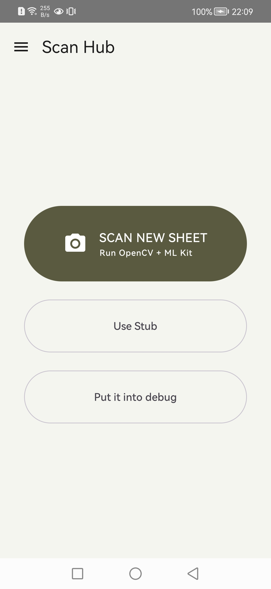
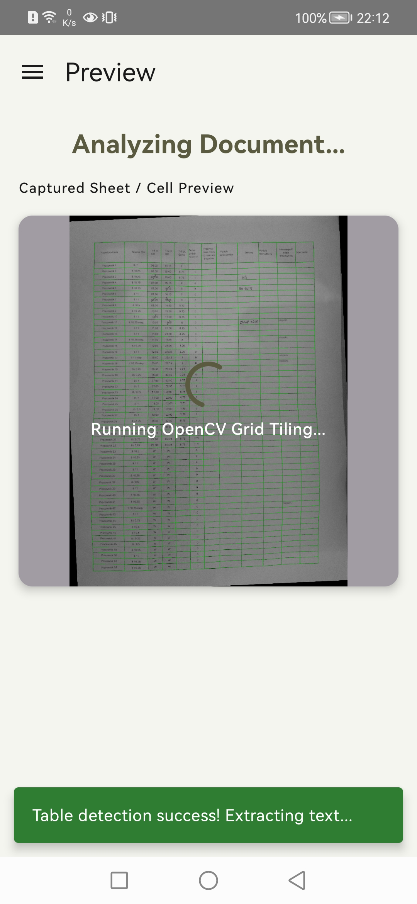
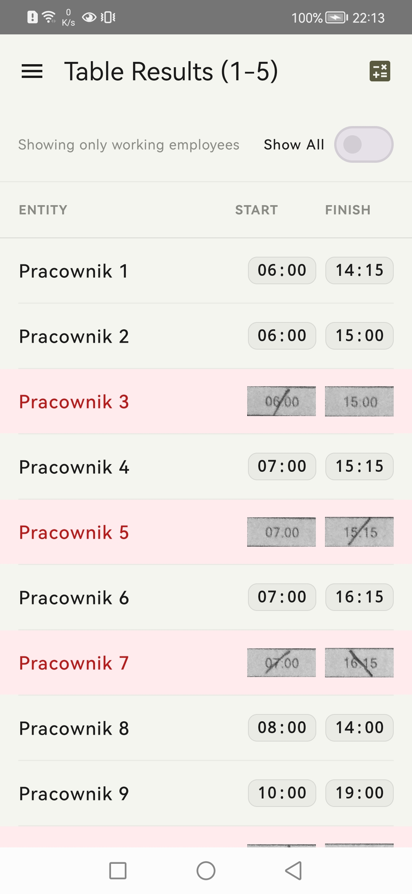
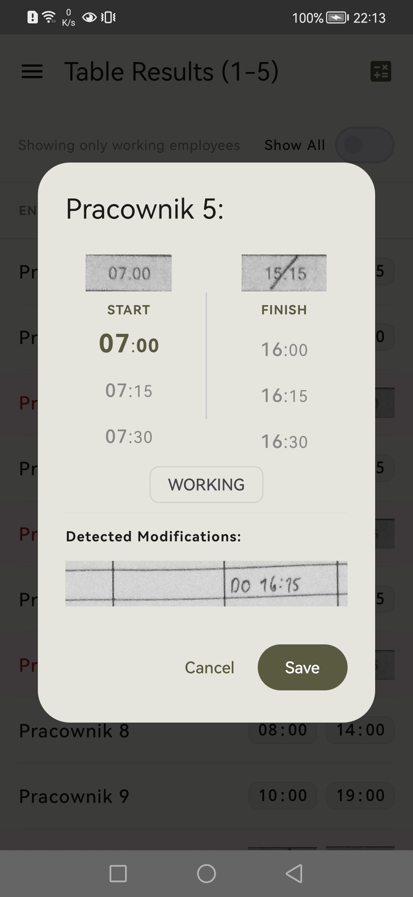
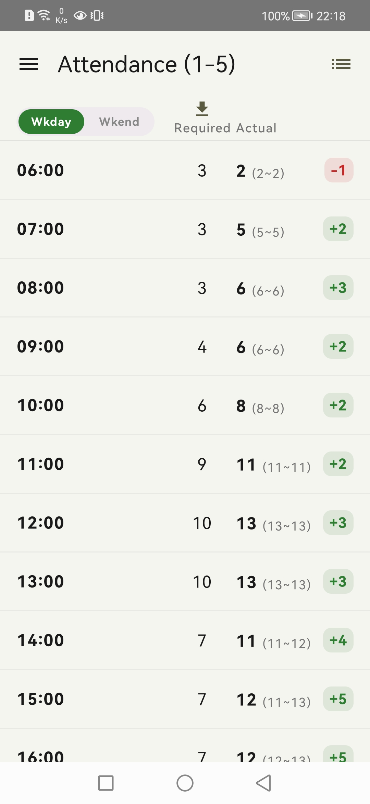

# ShiftSync

> Turn photographed worksheets into clear attendance and staffing information.

ShiftSync is an Android application for scanning paper-based work sheets and turning them into useful operational data. It detects table structure, reads text from photographed documents, and helps compare actual attendance with the people needed for the projected workload.

## What ShiftSync looks like

### 1. Scan a new worksheet

Start from the Scan Hub and capture a worksheet with the device camera.

<p align="center">
  
</p>
<p align="center"><em>Launch a new worksheet scan from the Scan Hub.</em></p>

### 2. Process and inspect the scan

ShiftSync analyzes the image, detects the table grid and cells, and extracts the text. A processing preview and diagnostic view help identify alignment or image-quality problems.

<p align="center">
  
</p>
<p align="center"><em>Review the captured sheet and the processing result.</em></p>

### 3. Review extracted attendance data

After processing, the detected rows and values are presented in an interactive results view so the scanned information can be reviewed in context.

<p align="center">
  
</p>
<p align="center"><em>Inspect the extracted table rows and attendance data.</em></p>

### 4. Review and edit an employee row

Each extracted employee row can be opened for review. ShiftSync shows the relevant cropped snippets from the original worksheet, including detected modifications, so start and finish times or absence information can be corrected when necessary.

<p align="center">
  
</p>
<p align="center"><em>Review the employee row and the cropped modification snippet from the worksheet.</em></p>

### 5. Compare attendance with staffing needs

The Attendance Summary and VLH workflows show the people recorded on the worksheet alongside the expected human requirement for each time slot.

<p align="center">
  
</p>
<p align="center"><em>Compare actual attendance with the automatically calculated staffing requirement.</em></p>

## Main capabilities

- Captures worksheet images with the device camera.
- Detects table structure, lines, and cells from photographed documents.
- Recognizes text from scanned cells.
- Provides processing previews and diagnostic imagery when detection needs attention.
- Presents extracted rows in an interactive results view.
- Provides attendance summaries and schedule-oriented workflows.
- Supports VLH management, including table scanning and crew requirement workflows.
- Pulls projected Guest Count (GC) values from a configured online Excel workbook.
- Automatically calculates the expected human requirement from the projected GC and the configured VLH rules.

## How the workflow works

```text
Capture worksheet
        ↓
Detect lines and table cells
        ↓
Recognize text
        ↓
Review extracted attendance data
        ↓
Compare actual attendance with projected staffing needs
```

## Projected Guest Count and staffing calculation

ShiftSync can be configured with the URL of an online Excel workbook containing projected GC values. The app downloads the relevant workbook data and uses the projection for the selected date and time period.

The projected GC is combined with the configured VLH table to calculate the expected number of people required for each time slot. This creates an operational comparison between the people actually present and the automatically calculated staffing need.

---

## Technical information

### Technology

- Kotlin and Android
- Jetpack Compose with Material 3
- CameraX
- OpenCV 4.12, including native C++ line detection
- Google ML Kit Text Recognition
- Kotlin Serialization and DataStore Preferences
- Apache POI for reading online Excel workbooks
- Gradle with Kotlin DSL

### Project structure

| Area | Purpose |
| --- | --- |
| `app/src/main/java/com/example/workflowocr` | Application screens, scan flow, OCR, table analysis, storage, and spreadsheet synchronization |
| `app/src/main/cpp` | Native OpenCV line-detection implementation |
| `app/src/androidTest` | Instrumented regression tests and public scan fixtures |
| `app/src/test` | Test and fixture-generation utilities |
| `app/src/main/res` | Android resources, themes, layouts, and app icons |

### Requirements

- Android Studio with Android SDK 36
- Android NDK `29.0.14206865`
- A device or emulator running Android 8.0 (API 26) or newer
- Camera permission for live worksheet capture

### Build the app

Clone the repository, open it in Android Studio, allow Gradle to sync, and select a suitable build variant. From a terminal, the debug build can be assembled with:

```bash
./gradlew assembleInternalDebug
```

On Windows:

```powershell
.\gradlew.bat assembleInternalDebug
```

The project provides `internal` and `production` product flavors. The internal flavor is intended for development and testing; use the production flavor for a production build.

> Release signing values are read from `local.properties`. Keep keystores, passwords, API keys, and other secrets out of version control.

### Testing

The project includes unit-test utilities and Android instrumentation tests for table-cell detection, cell analysis, and native line detection. Public image fixtures are stored under `app/src/androidTest/assets/test_fixtures_public`.

```bash
./gradlew test
./gradlew connectedCheck
```

## Privacy and permissions

ShiftSync needs camera access to photograph worksheets. Review the Android permission prompts and avoid scanning documents containing information that should not be processed on the device or included in test fixtures.

## License

> **Non-commercial use only.** Commercial use of this software, its APKs, or derivative works is strictly prohibited without explicit written permission from Adrian Kucharczuk.

See [LICENSE.txt](LICENSE.txt) for the full copyright and usage terms.
